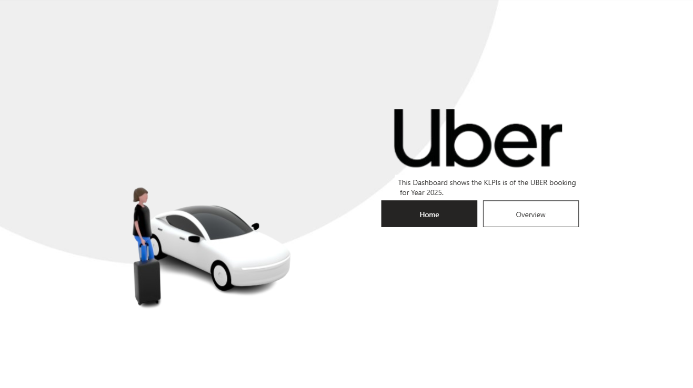
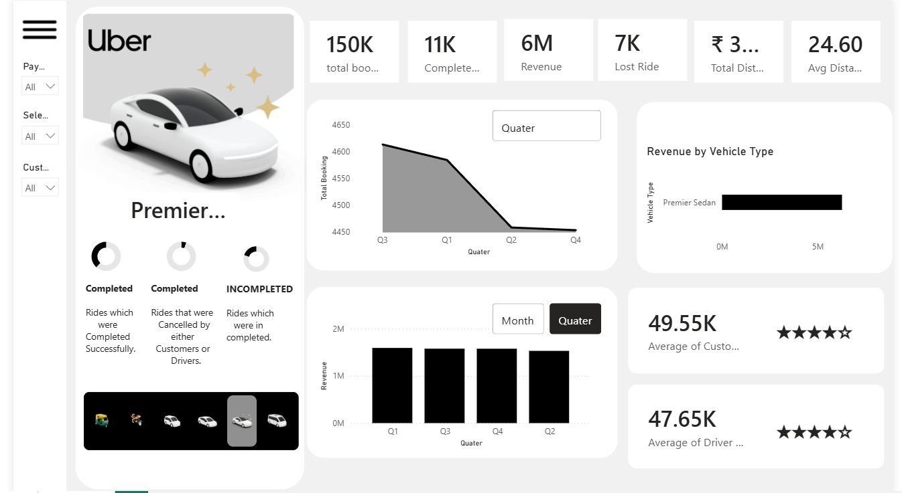

# Uber Ride Analytics Dashboard — Power BI

An interactive Uber ride analytics dashboard built using Microsoft Power BI.

## Project Overview

This project analyzes Uber ride booking data for Delhi NCR in 2025. The dashboard provides an interactive view of booking activity, ride status, revenue, vehicle types, locations, and other ride-related metrics.

## Tools Used

- Microsoft Power BI
- Power Query
- DAX
- Microsoft Excel

## Dashboard

The dashboard contains interactive visualizations for:

- Total bookings
- Completed and lost rides
- Revenue
- Vehicle types
- Booking trends
- Ride locations
- Payment and ride-related analysis

## Screenshots

### Home Page

### Overview Page

## Project Files

- `uber-dashboard.pbix` — Power BI dashboard file
- `home.png` — Dashboard home-page screenshot
- `Overview.png` — Dashboard overview screenshot

## Data Source

The project uses an Uber ride-booking dataset containing 150,000 records for analysis.

The dashboard was developed as a guided/tutorial-based Power BI project and further customized and analyzed by me.

> The source Excel dataset is not included in this repository.
